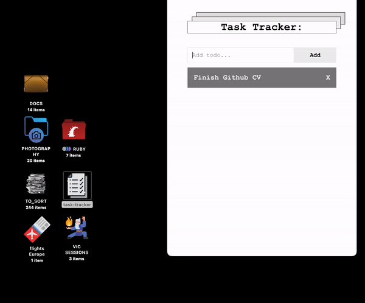
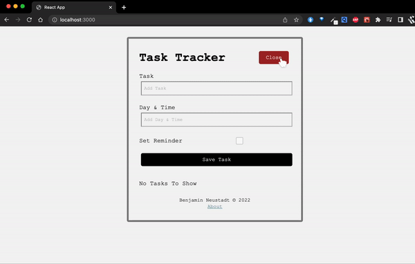

# Task Tracker

A simple and useful desktop app for keeping tabs on things to do throughout the day.

# NOTES during build:

### Used: 
> - NW.js
> - React
> - HTML
> - CSS

#### Solution to npm run start error:
  https://stackoverflow.com/questions/69692842/error-message-error0308010cdigital-envelope-routinesunsupported

To solve initial error when doing `npm run build`
`npm run start` works correctly from the get go. However, I have started using yarn instead of npm as it seems to verify the version also, instead of just attempting deprecated versions.

When the app is finished, we do `npm run build` it constructs a package that can be used as a desktop app.

#### Resources:

  https://www.npmjs.com/package/uuid
https://www.youtube.com/playlist?list=PL9lBpijO3nkEu7nP6HNuMbfidDytIvrqO
https://www.youtube.com/watch?v=EHvdi9qZB38

# Next exercise: 

I will build a slightly more complicated version that stores the inputs either into a database, or with a "fake" API using json-server, such as [this](https://github.com/BenjaminNeustadt/React-JS-crash-course) one I have done. However, it should run as a desktop app: 

